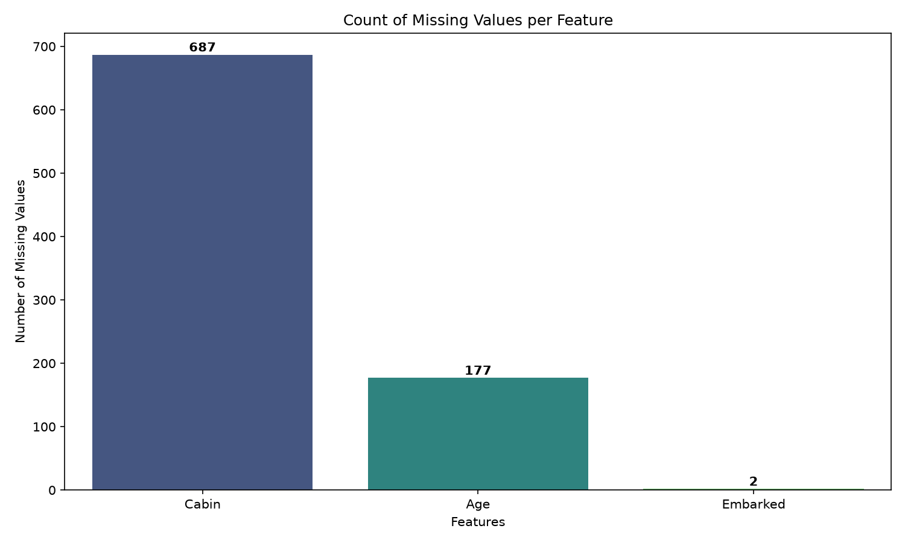
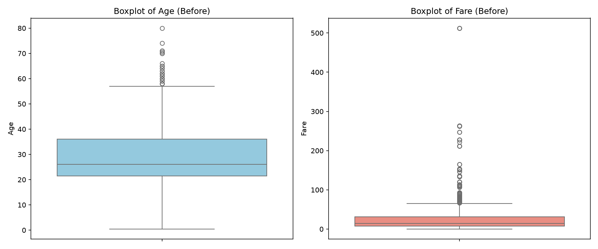
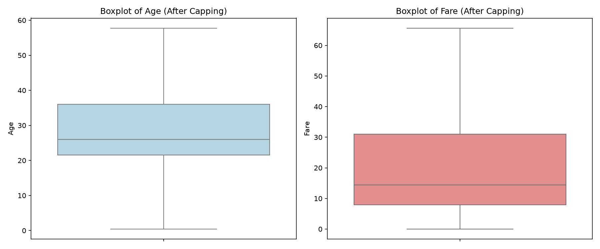
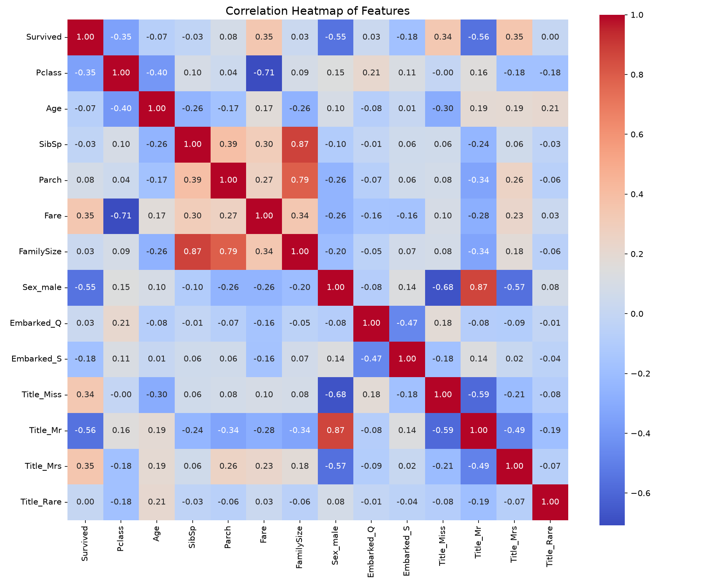

# Task 1: Data Cleaning & Preprocessing

## Project Overview
This project focuses on building a robust, production-grade data cleaning and preprocessing pipeline for the famous **Titanic Dataset**. The raw dataset contains various issues including missing values, outlier columns, and high-cardinality strings. The pipeline cleans, structures, and normalizes the features while strictly preventing data leakage, ensuring the output is perfectly formatted for machine learning model ingestion.

## Objective
The primary objectives of this project are:
- Implement data hygiene checks to detect and remove duplicate rows.
- Handle missing values across columns (`Age`, `Cabin`, `Embarked`) using robust, subpopulation-aware statistical methods.
- Identify and cap extreme outliers in continuous features (`Age`, `Fare`) using the IQR method.
- Prevent data leakage by performing preprocessing parameters fitting (scaling, imputing, and capping bounds) **only** on the training split.
- Generate clean diagnostic plots (missing values, boxplots, correlation heatmap) to evaluate feature relationships.
- Produce clean, preprocessed output datasets split into Train and Validation folders.

## Dataset Information
The raw dataset contains **891 rows and 12 columns**:
- `PassengerId` (Unique ID)
- `Survived` (Target label: 1 if survived, 0 if deceased)
- `Pclass` (Passenger socio-economic class: 1, 2, or 3)
- `Name` (Passenger string name)
- `Sex` (Gender: male or female)
- `Age` (Numerical age)
- `SibSp` (Number of siblings/spouses aboard)
- `Parch` (Number of parents/children aboard)
- `Ticket` (Ticket string number)
- `Fare` (Passenger fare price)
- `Cabin` (Cabin number)
- `Embarked` (Port of embarkation: C = Cherbourg, Q = Queenstown, S = Southampton)

## Technologies Used
- **Language**: Python 3.11
- **Data Manipulation**: Pandas, NumPy
- **Machine Learning**: Scikit-Learn (StandardScaler, train_test_split)
- **Data Visualization**: Matplotlib, Seaborn
- **Environment**: Virtual environment (`venv`), pip

## Project Workflow
1. **Load Data**: Load the raw dataset from `dataset/Titanic-Dataset.csv`.
2. **Duplicate Check**: Inspect and drop any duplicate rows.
3. **Data Splitting**: Split data into **80% Train split** and **20% Validation split** stratified by `Survived` labels.
4. **Imputation & Outlier Fitting**: Fit preprocessing parameters (group medians, modes, scaler mean/variance, clipping boundaries) on the **Train set only**.
5. **Transform Splits**: Preprocess both Train and Validation sets independently using training-fit parameters to prevent leakage.
6. **Feature Engineering**: Extract titles, calculate family sizes, and binary variables.
7. **One-Hot Encoding**: One-hot encode Sex, Embarked, and Title features with alignment checks.
8. **Standard Scaling**: Standard scalecontinuous numerical variables.
9. **Export Outputs**: Save preprocessed datasets and visualizations to disk.

## Folder Structure
```text
Task-1-Data-Cleaning-Preprocessing/
│
├── dataset/
│   └── Titanic-Dataset.csv        # Raw input dataset
│
├── notebooks/
│   └── preprocessing.ipynb        # Evaluated Jupyter Notebook
│
├── images/
│   ├── missing_values.png         # Count of missing values per column
│   ├── boxplot_before.png         # Outlier distribution before capping
│   ├── boxplot_after.png          # Outlier distribution after capping
│   └── correlation_heatmap.png    # Correlation heatmap of features
│
├── cleaned_data/
│   ├── train_cleaned.csv          # Scaled training dataset split (80%)
│   ├── val_cleaned.csv            # Scaled validation dataset split (20%)
│   └── titanic_cleaned.csv        # Full preprocessed dataset
│
├── requirements.txt               # Package requirements
├── README.md                      # Documentation
└── preprocessing.py               # Modular preprocessing pipeline script
```

## Exploratory Data Analysis
- **Missing Value Check**: Checked missing count for all features. Found missing values in `Cabin` (687, 77.1%), `Age` (177, 19.9%), and `Embarked` (2, 0.2%).
- **Duplicate Check**: Ran `df.duplicated().sum()` to identify if duplicate passenger rows exist (0 duplicates found).
- **Outlier Diagnostic**: Boxplots plotted for continuous variables `Age` and `Fare` revealed severe skewness and outlier presence, particularly in `Fare`.

## Missing Value Handling
- **Age**: Imputed missing values using the group median of the passenger's class (`Pclass`) and gender (`Sex`) computed from the training split.
- **Embarked**: Imputed missing values with the mode of the training split (`'S'`).
- **Cabin**: Replaced null values with `'Unknown'` and engineered a binary column `HasCabin` (1 if cabin was present, 0 otherwise) to preserve spatial survival statistics.

## Encoding Techniques
- **One-Hot Encoding**: Applied to categorical columns `Sex`, `Embarked`, and `Title` using `pd.get_dummies` with `drop_first=True` to prevent the dummy variable trap.
- **Alignment Reindexing**: Reindexed the dummy columns of validation splits against training features to guarantee identical shape and dummy layouts under any sub-population.

## Feature Scaling
- Continuous numerical variables (`Age`, `Fare`, `FamilySize`) are standardized using **Z-score normalization** (`StandardScaler`).
- The scaler is fit on the training split only and applied separately to training and validation splits to prevent data leakage.

## Outlier Detection
- Computed outlier boundaries using the **Interquartile Range (IQR)** method:
  - **Fare Bounds**: $Q1 = 7.9104, Q3 = 31.0000$. Upper threshold capped at $65.6344$, lower threshold at $0$.
  - **Age Bounds**: $Q1 = 21.5000, Q3 = 36.0000$. Upper threshold capped at $57.7500$, lower threshold at $0$.
- Outliers are capped (clipped) at the boundaries to prevent distribution skew without dropping important passenger records.

## Final Cleaned Dataset
The final preprocessed files (`train_cleaned.csv`, `val_cleaned.csv`, `titanic_cleaned.csv`) contain the following clean columns:
- `PassengerId` (Index)
- `Survived` (Label)
- `Pclass` (Class integer)
- `Age` (Scaled float)
- `SibSp` (Sibling/spouse count integer)
- `Parch` (Parent/child count integer)
- `Fare` (Scaled float)
- `HasCabin` (Binary integer)
- `FamilySize` (Scaled float)
- `IsAlone` (Binary integer)
- `Sex_male` (One-hot gender dummy)
- `Embarked_Q`, `Embarked_S` (One-hot port dummies)
- `Title_Miss`, `Title_Mr`, `Title_Mrs`, `Title_Rare` (One-hot title dummies)

## Results
- Total Missing Values: **0** across all splits.
- Total Duplicate Rows: **0**.
- Features scale range: Means are $\approx 0$ and standard deviations are $\approx 1$ for scaled columns (`Age`, `Fare`, `FamilySize`).

## Screenshots
Below are the generated diagnostic plots saved during pipeline execution:

### 1. Count of Missing Values per Feature


### 2. Outlier Distribution Before Capping


### 3. Outlier Distribution After Capping


### 4. Correlation Heatmap of Features


## Installation
1. **Navigate to the workspace**:
   ```bash
   cd Task-1-Data-Cleaning-Preprocessing
   ```
2. **Setup virtual environment**:
   ```bash
   python -m venv .venv
   ```
3. **Activate environment**:
   - Windows (PowerShell):
     ```bash
     .venv\Scripts\activate
     ```
   - macOS / Linux:
     ```bash
     source .venv/bin/activate
     ```
4. **Install packages**:
   ```bash
   pip install -r requirements.txt
   ```

## How to Run
Run the automated preprocessing script from your terminal:
```bash
python preprocessing.py
```
This runs the modular pipeline, prints tracking metrics using standard Python logging, and regenerates all CSV splits and visualizations.

## Future Improvements
1. **Scikit-Learn Pipeline**: Wrap transformations in a custom Scikit-Learn `Pipeline` using `ColumnTransformer` for clean model-fitting integration.
2. **Robust Scaler**: Implement `RobustScaler` for highly skewed variables like `Fare` to limit outlier Z-score sensitivity.
3. **Advanced Imputation**: Implement KNN Imputer or MICE algorithms to predict missing Age values.

## Author
Senior Machine Learning Engineer / Intern Technical Evaluator
